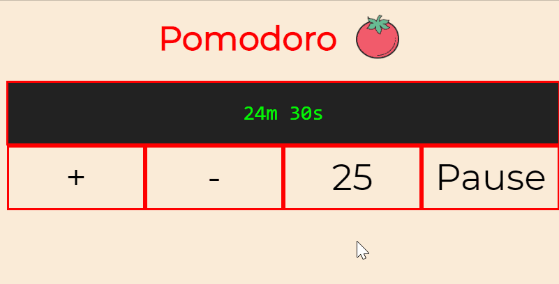

# PomodoroClock
A 25 minute study timer in vanilla js  

[Live site](https://jimryan.eu/PomodoroClock/)  

  

## Instructions

Click the plus sign to add a minute
Click the minus sign to subtract a minute
Click pause to pause the clock
Click 25 to start a new 25 minute timer

## Built With

* [Vanilla JS](https://developer.mozilla.org/en-US/docs/Web/JavaScript) - No frameworks used  

## Acknowledgments

* This project idea is from freeCodeCamp    
 

